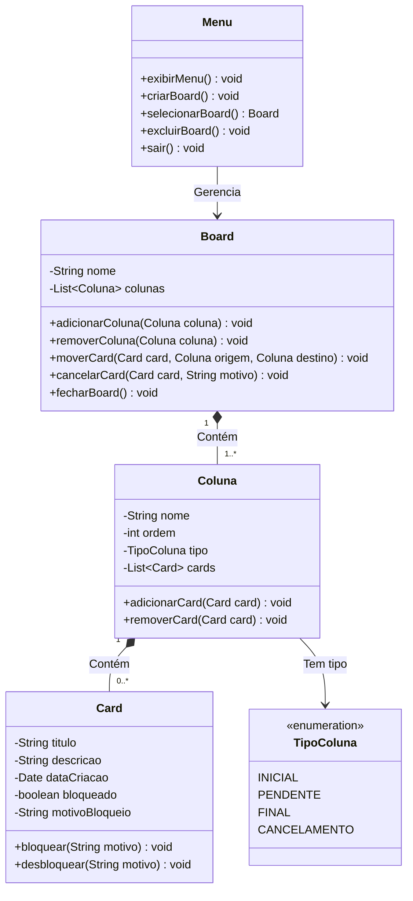

# taskboard
Desafio Dio Criando seu Board de Tarefas com Java

## Diagrama de classes

```mermaid
classDiagram
    class Menu {
        +exibirMenu() void
        +criarBoard() void
        +selecionarBoard() Board
        +excluirBoard() void
        +sair() void
    }

    class Board {
        -String nome
        -List~Coluna~ colunas
        +adicionarColuna(Coluna coluna) void
        +removerColuna(Coluna coluna) void
        +moverCard(Card card, Coluna origem, Coluna destino) void
        +cancelarCard(Card card, String motivo) void
        +fecharBoard() void
    }

    class Coluna {
        -String nome
        -int ordem
        -TipoColuna tipo
        -List~Card~ cards
        +adicionarCard(Card card) void
        +removerCard(Card card) void
    }

    class Card {
        -String titulo
        -String descricao
        -Date dataCriacao
        -boolean bloqueado
        -String motivoBloqueio
        +bloquear(String motivo) void
        +desbloquear(String motivo) void
    }

    class TipoColuna {
        <<enumeration>>
        INICIAL
        PENDENTE
        FINAL
        CANCELAMENTO
    }

    Menu --> Board : Gerencia
    Board "1" *-- "1..*" Coluna : Contém
    Coluna "1" *-- "0..*" Card : Contém
    Coluna --> TipoColuna : Tem tipo
```